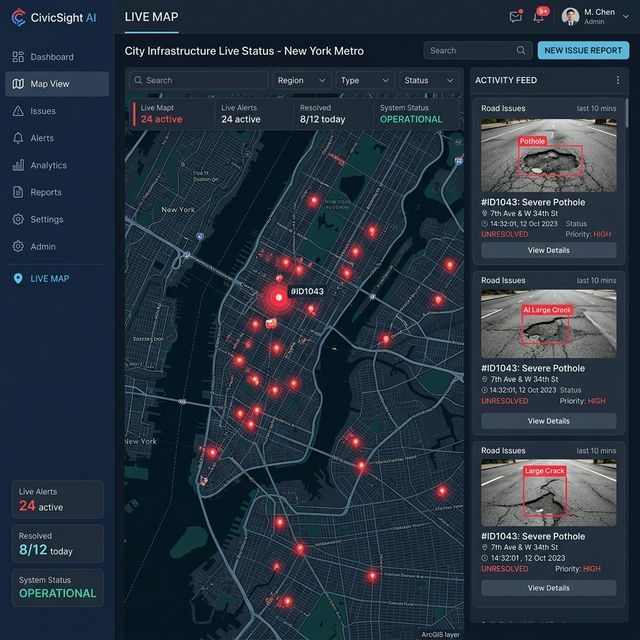

# SMC Smart Road Maintenance Dashboard
### Real-Time IoT Pothole Detection Platform (Frontend)



This is the fully interactive, responsive React frontend designed to serve as a **Live IoT Listener** for the SMC Road Maintenance project. It connects cleanly to a Django backend receiving data from a Raspberry Pi Zero W edge unit.

## 🚀 Live Demo
*[Insert Vercel / Netlify Link Here]*

## 🛠️ Tech Stack
- **Framework**: [React 18](https://react.dev/) + [Vite](https://vitejs.dev/)
- **Language**: TypeScript
- **Styling**: [Tailwind CSS](https://tailwindcss.com/)
- **Mapping**: [Leaflet](https://leafletjs.com/) (OpenStreetMap)
- **Icons**: [Lucide React](https://lucide.dev/)

---

## 💻 Getting Started (For Backend Developers & Collaborators)
Follow these exact steps to run the dashboard on your machine without encountering any missing dependency errors.

### 1. Prerequisites
Make sure you have [Node.js](https://nodejs.org/en) installed on your system (v18 or higher recommended).

### 2. Installation
Open your terminal inside this project folder and install all the raw dependencies (React, Tailwind, Leaflet, etc) by running:
```bash
npm install
```

*(Note: Sometimes if you pull from GitHub, your `node_modules` folder won't exist. Running this command builds the folder so the app knows how to run).*

### 3. Environment Setup (Optional for now)
If you ever want to add private keys (like Firebase or custom Mapbox tokens later), create a file named `.env.local` in the root directory. Currently, Leaflet is completely free and requires **no API Keys** to run!

### 4. Run the Development Server
Start the frontend server so you can view it live in your browser:
```bash
npm run dev
```
By default, it will open at `http://localhost:5173`.

---

## 📡 The Backend API Contract
The frontend is already configured to automatically poll the backend every **5 seconds**. 
The file you need to integrate your Django actual backend with is:
`src/services/api.ts`

Just swap out the placeholder `MOCK_POTHOLES` with your actual `fetch()` or `axios.get()` requests!

**Expected JSON format from Django (`GET /api/potholes`):**
```json
{
  "device_id": "PI-ZERO-001",
  "id": "ph-uuid-1234",
  "latitude": 21.1765,
  "longitude": 72.8314,
  "severity": "critical", 
  "confidence": 95.5,
  "image_url": "https://your-s3-link.jpg",
  "timestamp": "2024-03-19T10:30:00.000Z"
}
```

## 🏗️ Project Structure
* `/src/components` - The UI parts (Sidebar, KpiHeader, MapView, TaskCards)
* `/src/context` - Global state management for unifying map & feed activity
* `/src/hooks` - Contains the `usePotholeSync` hook that auto-polls Django
* `/src/pages` - Entire dashboard layouts (Map, Heatmap, Devices, Admin)
* `/src/types` - TypeScript interfaces ensuring strict API contracts
* `/src/services` - Where you put Axios or Fetch calls (`api.ts`)
